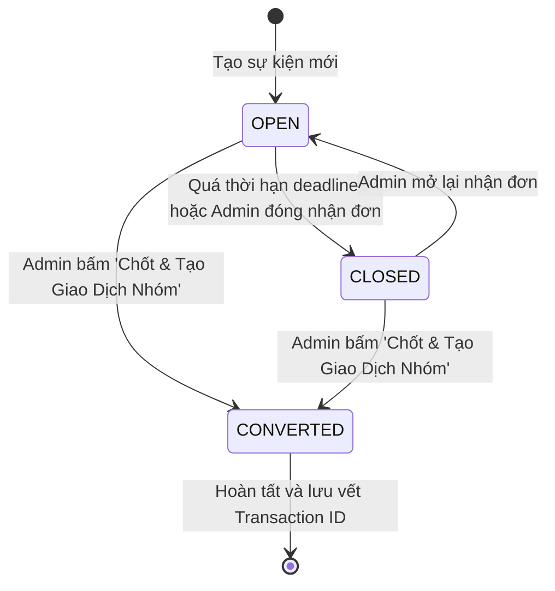

# Quy Tắc Nghiệp Vụ & Máy Trạng Thái (Business Rules & State Machines)

## 1. Quy Tắc Nghiệp Vụ Sự Kiện Mua Chung (Business Rules)

- **`BR-GB-01` (Tính Toàn Vẹn Của Mã Token Công Khai):** Mỗi sự kiện được cấp 1 `public_token` duy nhất dài 32 ký tự ngẫu nhiên (sinh bằng `bin2hex(random_bytes(16))`). Không cho phép truy cập sự kiện bằng ID số tuần tự để chống bruteforce.
- **`BR-GB-02` (Ràng Buộc Đơn Hàng Tối Thiểu):** Mỗi lượt đăng ký của người tham gia bắt buộc phải có ít nhất 1 món hàng được chọn với số lượng $\ge 1$.
- **`BR-GB-03` (Cú Pháp & Thông Tin VietQR Chuẩn):** Cú pháp chuyển khoản chuẩn được định dạng:
  `MC [ID Sự Kiện] [Tên Người Đăng Ký Không Dấu]` (Ví dụ: `MC 3 Nguyen Van A`). Thông tin tài khoản thụ hưởng mặc định lấy từ tài khoản ngân hàng của Người tạo sự kiện đã lưu trong bảng `users`. Nếu người tạo chưa cài STK, hệ thống sẽ cảnh báo yêu cầu cập nhật hồ sơ cá nhân.
- **`BR-GB-04` (Khóa Đăng Ký Khi Đã Hết Hạn / Đã Chốt):** Khi sự kiện chuyển sang trạng thái `closed` hoặc `converted`, trang công khai sẽ vô hiệu hóa toàn bộ nút đặt hàng, chỉ hiển thị thông báo "Sự kiện đã kết thúc nhận đăng ký".
- **`BR-GB-05` (Chuyển Thành Giao Dịch Nhóm):** Khi Admin nhấn chốt sự kiện thành Giao dịch:
  - Hệ thống tạo 1 bản ghi trong bảng `transactions` thuộc nhóm chi tiêu đó.
  - Người chi tiền (`payer_id`) là Admin tạo sự kiện.
  - Tổng số tiền hóa đơn bằng tổng số tiền của tất cả lượt đăng ký hợp lệ.
  - Mô tả giao dịch: `Mua chung: [Tên sự kiện]`.

---

## 2. Máy Trạng Thái Sự Kiện Mua Chung (State Machine)

