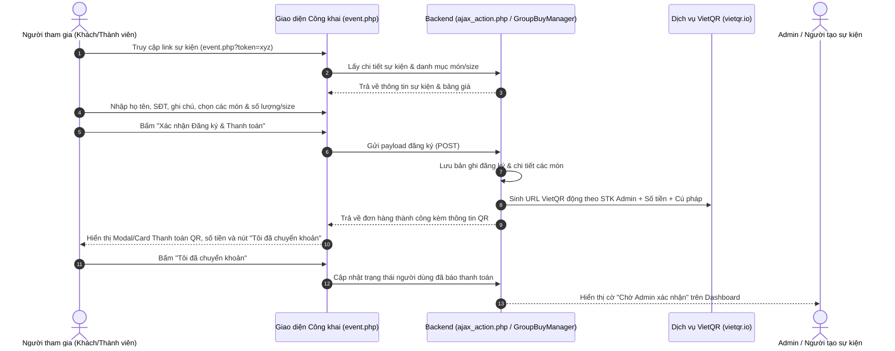
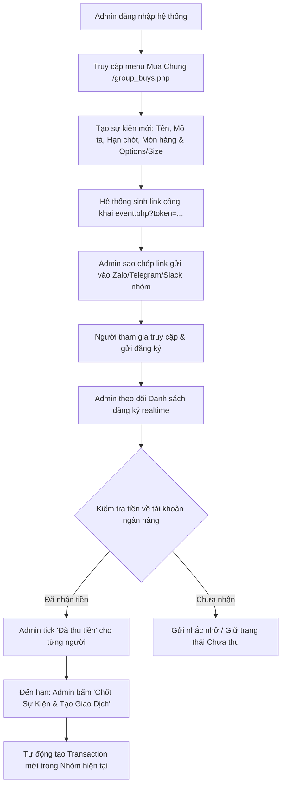

# Đặc tả Tính năng: Sự Kiện Mua Chung & Đăng Ký Công Khai (FEAT-001)

## 1. Tổng quan & Mục tiêu Nghiệp vụ
Tính năng **Sự kiện Mua Chung (Group Buy Events)** cho phép Admin hoặc thành viên nhóm tạo ra một sự kiện đặt đồ/mua sắm tập thể (ví dụ: mua áo đồng phục, đặt đồ ăn trưa, mua quà tặng, mua chung vật phẩm).
- **Public Share Link:** Hệ thống tự động sinh một đường dẫn công khai bảo mật với token/slug riêng biệt (`event.php?token=...`), cho phép bất kỳ ai có link mở ra xem thông tin và tự điền tên, chọn các tùy chọn (size, màu sắc, phân loại món).
- **Linh hoạt Cấu hình Món & Phân loại:** Người tạo sự kiện có thể cấu hình danh sách sản phẩm cùng các lựa chọn biến thể (options) và đơn giá tương ứng.
- **Tự Động Tính Tiền & VietQR Động:** Ngay sau khi người tham gia bấm đăng ký, hệ thống tính toán chính xác tổng tiền và hiển thị mã VietQR thanh toán tự động (lấy thông tin thụ hưởng từ cấu hình ngân hàng của Người tạo/Nhóm) kèm nút "Tôi đã chuyển khoản".
- **Quản lý Đơn & Chốt Hóa Đơn:** Người tạo sự kiện (Admin) có bảng điều khiển để theo dõi danh sách đăng ký theo thời gian thực, tick xác nhận "Đã thu tiền", và có thể bấm "Chốt & Tạo Giao Dịch" để đưa thẳng sự kiện này thành một hóa đơn giao dịch (Transaction) của nhóm chi tiêu.

---

## 2. Sơ đồ Luồng Tương tác (Sequence & Flowchart)

### 2.1 Luồng Đăng ký Mua Chung Công Khai (Public Participant Flow)


### 2.2 Luồng Quản lý & Chốt Giao dịch Nhóm (Admin Flow)


---

## 3. Đặc tả Giao diện & Ma trận 4 Trạng thái (UI Specs)

### 3.1 Màn hình Danh sách & Tạo Sự kiện (Admin: `group_buys.php`)
- **Mã định danh:** `SCR-GB-01`
- **Vị trí:** Menu Header chính (cạnh Giao dịch, Thành viên, Sản phẩm).
- **Thành phần:**
  - Nút "Tạo sự kiện mua chung mới".
  - Bảng danh sách các sự kiện của nhóm: Tên sự kiện, Thời hạn, Tổng số lượt đăng ký, Tổng tiền dự kiến, Đã thu, Trạng thái (Đang mở / Đã chốt / Đã hủy).
  - Modal/Form tạo sự kiện: Tên sự kiện, Mô tả chi tiết, Ngày hết hạn, Danh sách sản phẩm (Tên món, Phân loại/Size, Đơn giá).

### 3.2 Màn hình Chi tiết Quản lý & Thu tiền (Admin: `group_buy_detail.php`)
- **Mã định danh:** `SCR-GB-02`
- **Thành phần:**
  - Hộp thông tin sự kiện & Nút Copy Link công khai.
  - Bộ đếm thống kê: Tổng số lượng theo từng size/món (ví dụ: Size S: 5 cái, Size M: 12 cái, Size L: 8 cái) để admin dễ đặt hàng nhà cung cấp.
  - Bảng danh sách người tham gia: Họ tên, Số điện thoại, Món & Phân loại đã chọn, Tổng tiền, Trạng thái thanh toán (Chưa thu / Đã báo chuyển / Đã xác nhận thu), Nút Tick Toggle "Đã thu tiền", Nút Xóa/Hủy lượt đăng ký nếu có nhầm lẫn.
  - Nút hành động: "Chốt sự kiện & Chuyển thành Hóa đơn Nhóm".

### 3.3 Màn hình Đăng ký Công khai (Public: `event.php?token=...`)
- **Mã định danh:** `SCR-GB-03` (Trang riêng biệt, responsive mobile-first, giao diện sạch đẹp, không yêu cầu đăng nhập).
- **Thành phần:**
  - Banner tiêu đề sự kiện, mô tả, người tổ chức, hạn chót nhận đăng ký.
  - Form nhập thông tin: Họ và tên (*bắt buộc*), Số điện thoại / Nickname (*bắt buộc*), Ghi chú.
  - Danh sách chọn món: Radio/Checkbox chọn phân loại (Ví dụ: Áo thun -> Chọn Size S/M/L/XL), nút chọn số lượng (+/-).
  - Tự động nhảy tổng tiền realtime ở chân trang (Sticky Bottom Bar).
  - Nút CTA "Xác nhận Đặt hàng & Lấy mã VietQR".
  - Popup/Card VietQR sau đăng ký: Hiển thị mã QR chuẩn VietQR động, Số tiền chính xác, Tên ngân hàng, Số tài khoản, Tên chủ thẻ, Nội dung chuyển khoản chuẩn hóa (VD: `MC [MãĐơn] [Tên]`), Nút "Tôi đã chuyển khoản".

### 3.4 Ma trận 4 Trạng thái Giao diện (4 UI States Matrix)
| Màn hình | Loading State | Empty State | Error State | Success State |
|---|---|---|---|---|
| **Public Event (`SCR-GB-03`)** | Skeleton card tải thông tin món & size | "Sự kiện không tồn tại hoặc đã bị đóng." kèm nút quay lại | Thông báo "Link không hợp lệ hoặc sự kiện đã hết hạn" | Hiển thị form đăng ký & popup VietQR thanh toán kèm âm thanh/toast thông báo |
| **Admin Detail (`SCR-GB-02`)** | Spinner bảng danh sách đăng ký | "Chưa có ai đăng ký sự kiện này. Hãy chia sẻ link bên trên!" | Báo lỗi khi cập nhật trạng thái thu tiền thất bại | Cập nhật tick tức thì (Optimistic UI), Toast xanh "Đã cập nhật đã thu tiền" |

---

## 4. Tác động Cơ sở Dữ liệu (Database Schema DDL)

Cần bổ sung 4 bảng mới vào CSDL:
```sql
-- 1. Bảng sự kiện mua chung
CREATE TABLE IF NOT EXISTS `group_buy_events` (
    `id` INT UNSIGNED AUTO_INCREMENT PRIMARY KEY,
    `group_id` INT UNSIGNED NOT NULL,
    `creator_id` INT UNSIGNED NOT NULL,
    `title` VARCHAR(255) NOT NULL,
    `description` TEXT DEFAULT NULL,
    `image_url` TEXT DEFAULT NULL COMMENT 'Đường dẫn ảnh sản phẩm / mẫu áo',
    `public_token` VARCHAR(64) NOT NULL UNIQUE,
    `bank_bin` VARCHAR(20) DEFAULT NULL,
    `bank_account_no` VARCHAR(50) DEFAULT NULL,
    `bank_account_name` VARCHAR(100) DEFAULT NULL,
    `deadline` DATETIME DEFAULT NULL,
    `status` ENUM('open', 'closed', 'converted') NOT NULL DEFAULT 'open',
    `transaction_id` INT UNSIGNED DEFAULT NULL,
    `created_at` DATETIME DEFAULT CURRENT_TIMESTAMP,
    `updated_at` DATETIME DEFAULT CURRENT_TIMESTAMP ON UPDATE CURRENT_TIMESTAMP,
    FOREIGN KEY (`group_id`) REFERENCES `groups`(`id`) ON DELETE CASCADE,
    FOREIGN KEY (`creator_id`) REFERENCES `users`(`id`) ON DELETE CASCADE
) ENGINE=InnoDB DEFAULT CHARSET=utf8mb4 COLLATE=utf8mb4_unicode_ci;

-- 2. Bảng món hàng và các lựa chọn trong sự kiện (Items & Options)
CREATE TABLE IF NOT EXISTS `group_buy_items` (
    `id` INT UNSIGNED AUTO_INCREMENT PRIMARY KEY,
    `event_id` INT UNSIGNED NOT NULL,
    `name` VARCHAR(255) NOT NULL,
    `option_name` VARCHAR(100) NOT NULL COMMENT 'Ví dụ: Size S, Size M, Màu Đen, Phở Bò Tái',
    `price` DECIMAL(15, 2) NOT NULL DEFAULT 0.00,
    `created_at` DATETIME DEFAULT CURRENT_TIMESTAMP,
    FOREIGN KEY (`event_id`) REFERENCES `group_buy_events`(`id`) ON DELETE CASCADE
) ENGINE=InnoDB DEFAULT CHARSET=utf8mb4 COLLATE=utf8mb4_unicode_ci;

-- 3. Bảng lượt đăng ký của người tham gia
CREATE TABLE IF NOT EXISTS `group_buy_registrations` (
    `id` INT UNSIGNED AUTO_INCREMENT PRIMARY KEY,
    `event_id` INT UNSIGNED NOT NULL,
    `participant_name` VARCHAR(100) NOT NULL,
    `participant_phone` VARCHAR(20) DEFAULT NULL,
    `note` TEXT DEFAULT NULL,
    `total_amount` DECIMAL(15, 2) NOT NULL DEFAULT 0.00,
    `is_notified_paid` TINYINT(1) NOT NULL DEFAULT 0 COMMENT '1: Người dùng đã ấn nút Tôi đã chuyển khoản',
    `is_paid` TINYINT(1) NOT NULL DEFAULT 0 COMMENT '1: Admin đã tick xác nhận nhận được tiền',
    `paid_at` DATETIME DEFAULT NULL,
    `reg_token` VARCHAR(64) NOT NULL UNIQUE,
    `created_at` DATETIME DEFAULT CURRENT_TIMESTAMP,
    FOREIGN KEY (`event_id`) REFERENCES `group_buy_events`(`id`) ON DELETE CASCADE
) ENGINE=InnoDB DEFAULT CHARSET=utf8mb4 COLLATE=utf8mb4_unicode_ci;

-- 4. Bảng chi tiết món đã chọn của từng lượt đăng ký
CREATE TABLE IF NOT EXISTS `group_buy_registration_items` (
    `id` INT UNSIGNED AUTO_INCREMENT PRIMARY KEY,
    `registration_id` INT UNSIGNED NOT NULL,
    `item_id` INT UNSIGNED NOT NULL,
    `quantity` INT UNSIGNED NOT NULL DEFAULT 1,
    `unit_price` DECIMAL(15, 2) NOT NULL,
    `subtotal` DECIMAL(15, 2) NOT NULL,
    FOREIGN KEY (`registration_id`) REFERENCES `group_buy_registrations`(`id`) ON DELETE CASCADE,
    FOREIGN KEY (`item_id`) REFERENCES `group_buy_items`(`id`) ON DELETE CASCADE
) ENGINE=InnoDB DEFAULT CHARSET=utf8mb4 COLLATE=utf8mb4_unicode_ci;
```

---

## 5. Hợp đồng Giao tiếp & Tích hợp (API Contracts)

### 5.1 Public APIs (Không cần auth)
- `GET /event.php?token={public_token}`: Tải thông tin sự kiện & các món.
- `POST /ajax_action.php?action=group_buy_submit`:
  - Payload: `{ token: string, participant_name: string, participant_phone: string, note: string, items: [{ item_id: int, quantity: int }] }`
  - Response: `{ success: true, registration: { id: int, reg_token: string, total_amount: float, qr_url: string, bank_info: object } }`
- `POST /ajax_action.php?action=group_buy_notify_paid`:
  - Payload: `{ reg_token: string }`
  - Response: `{ success: true, message: "Thông báo đã chuyển tiền thành công!" }`

### 5.2 Admin APIs (Yêu cầu đăng nhập session)
- `POST /ajax_action.php?action=group_buy_toggle_paid`:
  - Payload: `{ registration_id: int, is_paid: 0|1 }`
  - Response: `{ success: true, is_paid: 0|1, paid_at: string }`
- `POST /ajax_action.php?action=group_buy_convert_to_transaction`:
  - Payload: `{ event_id: int }`
  - Response: `{ success: true, transaction_id: int, redirect_url: string }`

---

## 6. Quy tắc Nghiệp vụ (Business Rules - BR)
- **`BR-GB-01` (Bảo mật Link Công Khai):** `public_token` được sinh ngẫu nhiên 32 bytes hex (`bin2hex(random_bytes(16))`) đảm bảo không thể đoán mò.
- **`BR-GB-02` (Sinh VietQR Chuẩn):** Cú pháp chuyển khoản chuẩn: `MC [ID Sự Kiện] [Tên Người Đăng Ký Không Dấu]`. Số tiền lấy chính xác bằng `total_amount`.
- **`BR-GB-03` (Chuyển thành Giao dịch Nhóm):** Khi Admin chọn "Chốt & Tạo Giao Dịch":
  - Trạng thái sự kiện chuyển thành `converted`.
  - Tạo 1 `transaction` mới với tổng tiền = tổng tiền tất cả các lượt đăng ký.
  - Người trả tiền mặc định là Admin tạo sự kiện.
- **`BR-GB-04` (Khóa Chỉnh Sửa Khi Đã Chốt):** Sự kiện ở trạng thái `closed` hoặc `converted` sẽ tự động đóng form đăng ký trên link công khai, người dùng truy cập chỉ có thể xem trạng thái.

---

## 7. Kế hoạch Kiểm thử & Tiêu chuẩn Nghiệm thu (DoD)
1. **Kiểm thử Luồng Công Khai:** Đăng ký thành công không cần login, tính đúng tổng tiền món + size, sinh đúng ảnh VietQR.
2. **Kiểm thử Nút Báo Chuyển Khoản:** Khách ấn "Tôi đã chuyển khoản" -> CSDL ghi nhận `is_notified_paid = 1`.
3. **Kiểm thử Admin Tick:** Admin tick/bỏ tick "Đã thu tiền" hoạt động mượt qua AJAX, không reload trang.
4. **Kiểm thử Chuyển Đổi Giao Dịch:** Bấm chuyển đổi -> Tạo đúng transaction trong nhóm, liên kết `transaction_id`.
